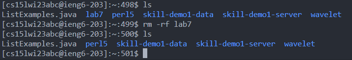
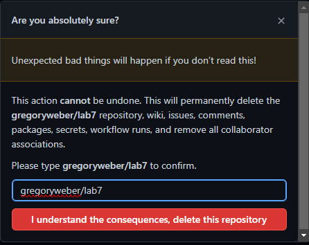
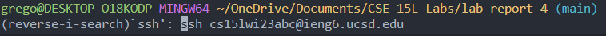
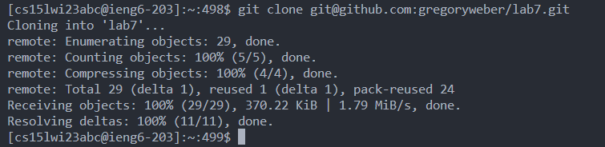
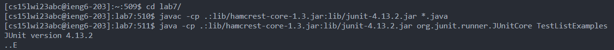
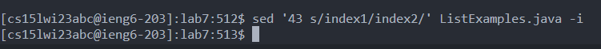
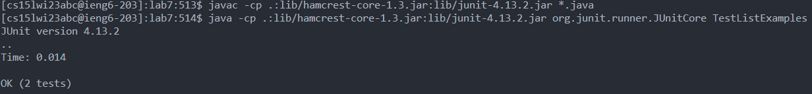
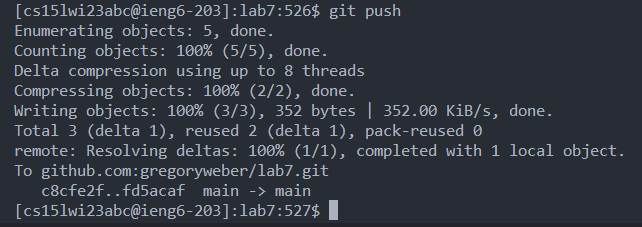
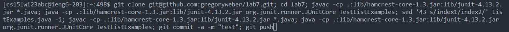

# Lab Report

## Setup

### 1. Delete existing forks of repository.

-   First, delete the local repository on ieng6.
-   This can be done with `rm -rf lab7/`
-   
-   Next, delete the repository remotely.
-   This can be done by logging onto the repository on Github, going to settings, then select "delete repository".
-   

### 2. Fork the repository.

-   Go to the [lab7 repository](https://github.com/ucsd-cse15l-w23/lab7), and press "fork".
-   

## Timed Tasks

### **NOTE:** I did this two ways. The first manual way follows the steps with each command individually. The second way is much faster, but might be invalid. I will first explain the first method, then showcase the second method.

### **FIRST METHOD:**

### 3. Timer starts now...

### 4. Logging onto ieng6

-   I previously typed in all of the other commands, so I was able to utilize `ctrl+r`.
-   To log onto ieng6, I first pressed `ctrl+r`, then typed `ssh`, then pressed `<enter>`. This popped up the command `ssh cs15lwi23abc@ieng6.ucsd.edu`. I then pressed `<enter>` to run the command.
-   
-   I did not need a password, as I had a ssh key on my local machine that I previously copied over to the remote machine.

### 5. Clone the forked repository onto ieng6.

-   Again, I pressed `ctrl+r`, then typed `git clone`, then pressed `<enter>`. The full command that was found is `git clone git@github.com:gregoryweber/lab7.git`. I then pressed `<enter>` to run the command.
-   
-   I also cloned this repository with ssh, meaning I setup a ssh key on the remote computer which I then copied over to the remote computer. This is to avoid any username or password issues when pushing any future commits.

### 6. Run the JUnit tests.

-   I first pressed `ctrl+r`, then typed `cd`, then pressed `<enter>`. This brought up the full command `cd lab7/`. I then pressed `<enter>` to run the command.
-   I then pressed `ctrl+r` again, then typed `javac`, then pressed `<enter>`. This brought up the full command `javac -cp .:lib/hamcrest-core-1.3.jar:lib/junit-4.13.2.jar *.java`. I then pressed `<enter>` to run the command.
-   I did the same thing in order to run the tests: pressed `ctrl+r`, typed `java <space>`, pressed enter (the full command being `java -cp .:lib/hamcrest-core-1.3.jar:lib/junit-4.13.2.jar org.junit.runner.JUnitCore TestListExamples`), then pressed `<enter>` in order to run the command.
-   
-   You can see from the image above that 1 test has failed (..E).

### 7. Editing the code to fix the failed test.

-   I again pressed `ctrl+r`, typed `sed`, then pressed `<enter>`. The full command displayed was `sed '43 s/index1/index2/' ListExamples.java -i`. I then pressed `<enter>` to run the command.
-   
-   This command fixes the error in line 43, as it replaces `index1` with `index2`, which is what it should be.

### 8. Running the tests to show that they succeed.

-   To rerun the tests, I repeat the keystrokes when I originally ran the tests.
-   `ctrl+r`, then typed `javac`, then pressed `<enter>`, then pressed `<enter>` to run the command.
-   `ctrl+r`, then typed `java <space>`, then pressed `<enter>`, then pressed `<enter>` to run the command.
-   
-   With the error fixed, the tests now all pass.

### Committing and pushing the changes to Github.

-   In order to commit the changes, I pressed `ctrl+r`, then typed `git commit`, then pressed `<enter>`. The full command found was `git commit -a -m "Updated"`. I then pressed `<enter>` to run the command.
-   This command both adds all changes and new files, as well as commits them with the commit message being "Updated".
-   In order to push the changes, I typed `git push`, then pressed `<enter>`.
-   

### Method 1 Done!

### Method 2:

-   For this method, all of the above commands are the same; instead they are all chained together on a single line, so that the amount of key strokes is heavily reduced.
-   I first repeat the key strokes to ssh into ieng6.
-   I then press the up arrow key once to reach the large command.

```
[cs15lwi23abc@ieng6-203]:~:498$ git clone git@github.com:gregoryweber/lab7.git; cd lab7; javac -cp .:lib/hamcrest-core-1.3.jar:lib/junit-4.13.2.jar *.java; java -cp .:lib/hamcrest-core-1.3.jar:lib/junit-4.13.2.jar org.junit.runner.JUnitCore TestListExamples; sed '43 s/index1/index2/' ListExamples.java -i; javac -cp .:lib/hamcrest-core-1.3.jar:lib/junit-4.13.2.jar *.java; java -cp .:lib/hamcrest-core-1.3.jar:lib/junit-4.13.2.jar org.junit.runner.JUnitCore TestListExamples; git commit -a -m "test"; git push
```

-   
-   I then pressed `<enter>` to run the command. This finishes all of the steps

### Method 2 Done!
